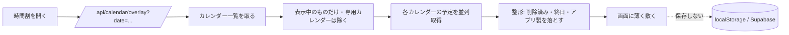

# Googleカレンダーの本物の予定を、時間割に重ねて表示する（B案）

日付：2026-09-07
種別：実装
状態：完了（本番へ反映済み。**環境変数を入れるまでは動かない**）

## 結論

時間割の画面に、**あなたのGoogleカレンダーの本物の予定が薄く重なって表示される**ようになった。
空き時間が一目で分かる。

重要な性質が3つある。

1. **書き込みは増えていない。** アプリが書き換えられるのは、これまでどおり
   専用カレンダー「目標設定コーチ」だけ。あなたの予定は読むだけで、壊せない。
2. **アプリに保存しない。** 重ねた予定は画面上にしか存在しない。
   localStorage にも Supabase にも書かない。
3. **押せない。** 背景として敷いてあるだけなので、その上を押せば普通に枠を作れる。

## 依頼と背景

「グーグルカレンダーの内容も反映されていない」という指摘に対し、
[調査](2026-09-07-カレンダー未反映の調査.md)で次が分かっていた。

- 連携機能は本番に無く、一度も接続されていない
- **さらに、たとえ連携しても仕様上メインカレンダーの予定は出てこない**
  （権限が `calendar.app.created` のみで、アプリが作ったカレンダーしか見えない）

そこで3案を提示し、**B案（メインを読み取り専用で重ねて表示）**を選んでいただいた。

| 案 | 内容 | 判断 |
|---|---|---|
| A | 専用カレンダーとの双方向のみ（現状） | 欲しいものが得られない |
| **B** | ＋メインを読み取り専用で重ねる | **採用** |
| C | メインと直接双方向 | アプリの不具合が本物の予定を壊しうる |

## 変更内容

### なぜ「取り込む」ではなく「重ねる」なのか

素直に取り込むと壊れる。同期エンジンは **1つのカレンダーしか相手にできない**
（`link.calendarId` が単一）ため、こうなる。

1. メインの「マッチングアプリ」をアプリの枠として取り込む
2. 次の同期で、アプリはそれを**専用カレンダーにも作る** → Googleに同じ予定が2つ
3. さらに次の同期で、その予定は専用カレンダーには無いIDなので「削除された」と判定

だから混ぜない。重ねるだけにした。

### 追加・変更したもの

| ファイル | 内容 |
|---|---|
| [`src/lib/calendar/google.ts`](../../src/lib/calendar/google.ts) | スコープを書き込み／読み取りに分離。`listCalendars()` 追加 |
| [`src/lib/calendar/overlay.ts`](../../src/lib/calendar/overlay.ts) | 表示用に整える純粋関数（新規） |
| [`src/app/api/calendar/overlay/route.ts`](../../src/app/api/calendar/overlay/route.ts) | 読み取り専用API（新規） |
| [`src/components/DayGrid.tsx`](../../src/components/DayGrid.tsx) | 背景レイヤーの描画 |
| [`src/app/plan/page.tsx`](../../src/app/plan/page.tsx) | 日付ごとに取り直す |
| [`src/components/CalendarLink.tsx`](../../src/components/CalendarLink.tsx) | 増えた権限を正直に説明 |
| [`tests/calendar-overlay.test.mjs`](../../tests/calendar-overlay.test.mjs) | 13件（新規） |

### 権限の分け方

```
書き込み: calendar.app.created  … アプリが作ったカレンダーだけ（変更なし）
読み取り: calendar.readonly     … 本人の全カレンダー（今回追加）
```

**読める範囲は広がるが、書ける範囲は1ミリも広がっていない。**
万一トークンが漏れても、あなたのカレンダーは書き換えられない。

### 重ねるときに落とすもの

- 削除済み（`status: "cancelled"`）
- 終日予定（時刻を持たず、時間割の上に置けない）
- **アプリが作った予定**（印が付いている）。既に枠として描かれているので、
  重ねると同じ予定が二重に見える
- Googleカレンダー側で**非表示にしているカレンダー**
  （向こうで消しているのにこちらで出るのは意思に反する）

日をまたぐ予定は**落とさず、その日の範囲へ切り詰める**。
落とすと「空いている」ように見えて、埋まっている時間に予定を入れてしまう。

### 性能への配慮

カレンダーごとに1往復するので、直列だと数が多いほど画面が遅れて埋まる。
並列（`Promise.allSettled`）にし、1つ読めなくても他は出す。上限8件。

## 仕組みの説明



## 確認したこと

| 確認 | 方法 | 結果 |
|---|---|---|
| 整形の境界 | `tests/calendar-overlay.test.mjs` 13件 | 全通過 |
| 型・全テスト・本番ビルド | `tsc` / `npm test` / `next build` | すべて通過（117ファイル走査） |
| 未連携でも壊れない | ローカルで `/api/calendar/overlay` を叩く | `{ok:true, events:[]}`。500にならない |
| 不正な日付 | `?date=あいうえお` | `{ok:false}` で拒否。Googleを叩かない |
| 実際に重なるか | 応答を差し替えて3件返す | 3件とも描画。日跨ぎも 00:00〜02:00 で表示 |
| 押せないこと | `pointer-events` を確認 | `none` |
| **保存されないこと** | 重ねた後に localStorage を確認 | 時間割9件のまま。1件も増えていない |
| 本番 | デプロイ後に叩く | `{ok:true, events:[]}`、`status` も正常 |

**未実施**: Google API との実通信。環境変数が無いため接続できない。
整形ロジックは単体で、描画は応答を差し替えて確認している。

## 残っていること

### これを使うために必要（本人の操作が要る）

私は秘密の値を入力できず、`vercel` CLI も未ログインのため代行できない。

1. **Vercel に環境変数を入れる**（Production と Preview の両方）

   ```
   vercel login
   bash scripts/push-env-to-vercel.sh --apply
   ```

2. **Google Cloud の「承認済みリダイレクトURI」に追加**

   ```
   https://prototype-management-tool.vercel.app/api/calendar/callback
   ```

3. **OAuth同意画面のスコープに `calendar.readonly` を追加**
   （テスト中のアプリなので、スコープを増やすと再同意が要る）

4. アプリの設定画面から「連携する」を押す

### 既知の限界

- 同じ時間に複数の予定が重なると、背景同士が重なって文字が読みにくい。
  背景としての用は足すが、数が多いと見づらい
- 日付を切り替えるたびに取り直す（キャッシュしていない）。
  切り替えを連打すると、そのぶん通信が増える
