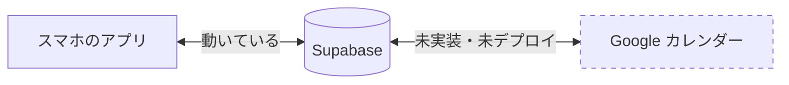

# 「昨日入れた内容」と Google カレンダーが反映されない件の調査

日付：2026-09-07
種別：調査
状態：一部完了（カレンダー側は原因確定。「昨日入れた内容」は追加確認が必要）

## 結論

**Google カレンダーとは同期できていません。** 機能そのものが本番に存在しないためです。

1. **カレンダー連携のコードは本番（`main`）に1ファイルも入っていない。**
   実装は作業ブランチ `feat/google-calendar-sync` にあり、レビュー途中で未マージ。
   本番に出ているのは設計文書だけ。
2. **Google アカウントとの接続も一度も行われていない。**
   接続情報を保管する `google_calendar_links` テーブルは**0行**。
3. アプリが今日表示している1件は、クラウドの内容と**完全に一致**している。
   表示側の不具合ではない。

「昨日入れた内容」については、**9月6日にクラウドへ保存された予定が1件も無い**ことまで
確認できました。ただし「アプリに入れたが同期されなかった」のか
「アプリ以外（Google カレンダー）に入れた」のかは、まだ切り分けられていません。
最後の「確かめてほしいこと」を実施いただければ確定します。

## 依頼と背景

スマホで次の2点を指摘された。

- 昨日入れた内容がアプリに反映されていない
- Google カレンダーの内容がアプリに反映されていない

いただいたスクリーンショット3枚の内容：

| 画面 | 表示 |
|---|---|
| アプリ 時間割（9/07） | 予定 30分・1件「副業の加速化をする」12:15〜12:45 |
| アプリ 設定 | `koukaku1115@gmail.com` でログイン中／**自動で同期しています** |
| Google カレンダー（9/07） | 「マッチングアプリ」9:00〜10:00、「ミン卓告知→稼ぐ力を高めるAIワークフロー」12:00〜13:00 |

## 調査結果

コード変更はしていない。以下はすべて観測した事実。

### 事実1: カレンダー連携は本番に存在しない

```
$ git ls-tree -r main --name-only | grep -i calendar
docs/superpowers/plans/2026-09-05-google-calendar-sync.md
docs/superpowers/specs/2026-09-05-google-calendar-sync-design.md
```

ヒットしたのは**設計文書2件のみ**。実装（`src/lib/calendar/`、`CalendarSyncBoot.tsx`、
`/api/calendar`、設定画面の連携UI）はすべて `feat/google-calendar-sync` ブランチにあり、
`main` に入っていない。

設定画面のスクリーンショットに「Googleカレンダー連携」の項目が無いことも、これと一致する。

### 事実2: Google アカウントとの接続実績がゼロ

接続情報を保管する `google_calendar_links` テーブルは存在するが **0行**。
どのユーザーも一度も連携していない。

### 事実3: 9月6日にクラウドへ保存された予定は1件も無い

```sql
select u.email, t.date, t.start_time, t.title, t.created_at
from timeboxes t join auth.users u on u.id = t.user_id
where t.date between '2026-09-05' and '2026-09-08'
order by t.created_at desc;
```

| 作成日時（UTC） | 予定の日付 | 内容 |
|---|---|---|
| 2026-09-07 03:16 | 09-07 | 副業の加速化をする |
| 2026-09-05 14:08 | 09-05 | 読書しながらリラックスする。 |
| 2026-09-05 12:50 | 09-05 | アプリ制作をやりましょう。 |
| 2026-09-05 03:57 | 09-05 | ダンスの練習。ポップコーンを練習する。 |
| 2026-09-05 03:37 | 09-05 | マッチングアプリでいいねしへ返信 |
| 2026-09-05 03:25 | 09-05 | ご飯、アプリ制作 |

**9月5日 14:08 から 9月7日 03:16 まで、約37時間ぶん作成が1件も無い。**
9月6日を日付に持つ予定も0件。

### 事実4: 表示は正しい

クラウドにある 9/07 の予定は「副業の加速化をする」1件のみで、
アプリの表示「予定 30分・1件」と一致する。アプリが取りこぼしているのではない。

### 事実5: ローカル開発環境にも9/06のデータは無い

このPCのディスクバックアップ（`.local-backups/`、9/07 08:44 に書かれた最新）を確認。
日付別の件数は 8/29:4件、8/31:2件、9/01:2件、9/04:1件、9/07:1件。
**9/05 も 9/06 も無い**（ローカル開発環境はログアウト状態でクラウドと繋がっていないため、
9/05分も入っていない）。

## 仕組みの説明

いま本番で動いているのは「アプリ ⇄ Supabase」の同期だけ。



Google カレンダーに予定を入れても、アプリには何も届かない。逆も同じ。
両者をつなぐ部品が、まだ本番に置かれていないため。

設定画面の「自動で同期しています」は、**Supabase との同期**が正常という意味で、
Google カレンダーのことではない。ここは紛らわしい。

## 関連ファイル・根拠

- [`docs/superpowers/plans/2026-09-05-google-calendar-sync.md`](../superpowers/plans/2026-09-05-google-calendar-sync.md) — 実装計画（本番にあるのはこれだけ）
- `feat/google-calendar-sync` ブランチ — 実装本体（未マージ）
- [`src/app/settings/page.tsx`](../../src/app/settings/page.tsx) — 「自動で同期しています」の文言（Supabase同期の状態）

## 確認したこと

| 確認 | 方法 | 結果 |
|---|---|---|
| 本番にカレンダー実装があるか | `git ls-tree -r main` | 設計文書のみ。実装なし |
| Google と接続済みか | `google_calendar_links` の行数 | 0行。接続実績なし |
| 9/06 にクラウド保存があったか | `timeboxes` を作成日時順に照会 | 9/05 14:08 → 9/07 03:16 の間は0件 |
| 表示が取りこぼしていないか | クラウドの 9/07 の件数と画面を突き合わせ | 一致（1件） |
| ローカルに9/06分が残っていないか | `.local-backups/` の最新を走査 | 無し |

**未確認**: スマホ本体の localStorage は外から見られないため、
「アプリには入れたがクラウドに届かなかった」可能性を否定しきれていない。

## 残っていること

### 確かめてほしいこと（1分）

スマホでアプリを開き、時間割の **←（前の日）** を押して **9月6日** を表示してください。

- **予定が出る** → アプリには保存されているがクラウドへ届いていない（同期の不具合。要調査）
- **何も出ない** → 昨日の入力はアプリではなく Google カレンダー側だった（今回の結論どおり）

### カレンダー連携を本番に出すか

実装は `feat/google-calendar-sync` にあるがレビュー途中。本番へ出すには、
残りのレビューを終えてマージする必要がある。着手するかは未決。

### 文言の改善（提案）

設定画面の「自動で同期しています」は Supabase 同期を指すが、
Google カレンダーと取り違えやすい。「クラウド（Supabase）と自動で同期しています」
のように、対象を明示したほうがよい。今回は変更していない。
