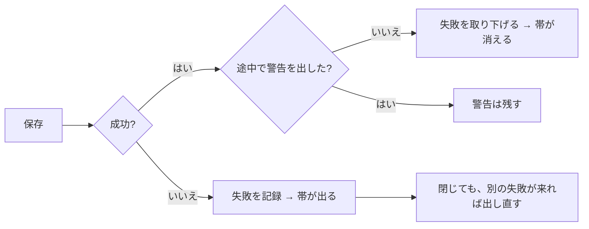
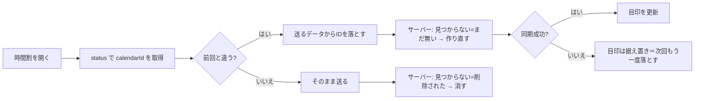

# レビュー指摘3件と改善2件をまとめて対応

日付：2026-09-07
種別：修正
状態：完了（`main` へマージし、本番へ反映済み）

## 結論

前日レビューの指摘3件と、改善提案の2件をすべて直した。あわせて
**自分の修正を自分でレビューして、新たに入れてしまった重大な不具合1件を見つけて直した**。

| # | 内容 | 状態 |
|---|---|---|
| 指摘1 | 同期エラーの帯が消えない／閉じたら戻らない | 完了 |
| 指摘2 | カレンダー再連携で時間割の枠が削除される | 完了 |
| 指摘3 | 24:00 に終わる枠がカレンダーと噛み合わない | 完了 |
| 改善2 | 初回起動が空の時間割に着地し、対話への導線が無い | 完了 |
| 改善3 | 振り返りの文章が書き捨てになっている | 完了 |
| 自己レビュー | 再連携の目印を成功前に書いていた（新規混入） | 完了 |

追加したテストは **50件**。すべて `npm test` に組み込み、型チェックと本番ビルドも通した。

## 依頼と背景

「全て実施してください。テストと、レビューもやることは必須」。
対象は [前日分コードレビュー](2026-09-07-前日分コードレビュー.md) の指摘3件と、
[次に取り組む改善3件](2026-09-07-次に取り組む改善3件.md) の改善2・3
（改善1は [別途対応済み](2026-09-07-時間割IDのUUID化.md)）。

## 変更内容

### 指摘1: 同期エラーの帯が消えない／閉じたら戻らない

**症状**: `lastSyncError` に `null` を代入する箇所がコード全体に一つも無く、
一度でも同期に失敗すると、その後どれだけ成功しても帯が出続けた。
さらに「閉じる」を押すと `dismissed` が二度と戻らず、**本物の失敗が完全に無言**になった。
黙って壊れるのを防ぐための帯が、黙る仕組みを持っていた。

**直した内容**

- `clearFailure()` を追加。成功したら失敗を取り下げる
- `pushKey` を `pushOne`（書き込み本体）と分離し、成功判定を1箇所にまとめた
- **通知回数（`failureSeq`）で「この処理中に新しい失敗が出たか」を見る。**
  中で警告を出しつつ全体は成功する経路（不正IDの除外）で、
  その警告まで消してしまうのを防ぐため
- `backfillAll` の成否判定も回数比較へ。
  `lastSyncError` の中身を比べる形だと、成功して `null` になった瞬間に
  「前と違う＝失敗」と数えてしまう
- 自己修復が成功したら、引き金になった失敗を取り下げる
- 帯の「閉じる」を**その状況に紐づける**（`dismissedKey`）。別の失敗が起きれば必ず出し直す
- 表示判定を純粋関数 `shouldShowSyncBar` / `syncBarKey` に切り出し、総当たりでテスト（10件）

### 指摘2: カレンダー再連携で時間割の枠が削除される

**症状**: エンジンは「送ったIDが取得結果に無い＝削除された」と判断する。
別のカレンダーへ繋ぎ直すと新しいカレンダーにはどのIDも無いので、
**全部の枠が削除対象**になり、5件までは無言で消えた。

**採った方法**: レビューは「推論そのものをやめる」を第一候補としていたが、
実際に外してみると **既存テスト #8 と真正面から衝突した**。

| 入力 | #8 の期待 | 再連携の期待 |
|---|---|---|
| IDを持つ枠 + 取得結果が空 | 削除する | 作り直す |

同じ入力に正反対を求めており、エンジンだけでは区別できない。
そこでレビューの代替案どおり、**判断を「カレンダーが変わったことを知っている層」へ移した**。

- `/api/calendar/status` が `calendarId` を返す
- `clearEventIdsIfCalendarChanged()`（純粋関数）が、前回と違えば全IDを落とす
- `CalendarSyncBoot` が端末固有の目印（`gc.lastCalendarId`）と突き合わせる
- エンジンの推論はそのまま（同じカレンダーの中では正しい判断なので）

落とさない条件も固定した。初回・状態不明・同一カレンダーでは触らない
（初回に落とすと、既にある予定を作り直して重複させる）。

### 指摘3: 24:00 に終わる枠がカレンダーと噛み合わない

RFC3339 は 24 時を表現できない（`time-hour = 2DIGIT ; 00-23`）のに、
`end: "24:00"` はこのアプリの正規の値だった。

- `toRfc3339` が 24:00 を**翌日の 00:00** へ直す（日付の加算は `date.ts` 経由）
- `foldEndToSameDay()` が読み戻すときに畳み直す
- **取り込み側にも同じ処理を入れた。**
  送信側だけ直すと、Googleで作った 23:00〜翌0:00 の予定が
  「日をまたぐ」と見なされて無言で取り込まれない非対称が残る
- `updateBox` に日跨ぎガードを追加（取り込み側にはあったが、こちらに無かった）

### 改善2: 初回起動が空の時間割に着地する

既定表示を時間割にしたことで、何も持っていない人が最初に見るのが
空のグリッドと＋ボタンだけになっていた。

- `shouldShowOnboarding()`（純粋関数）で「本当に何も持っていない人」だけに絞る
- 時間割の上に案内カードを出す。**所要時間（約30〜40分）を先に書く**
  （離脱の最大要因が「思ったより長い」ため / mvp-spec §3.2）
- 「先に時間割だけ使う」で閉じられる＝判断を奪わない

### 改善3: 振り返りの文章が書き捨てになっている

「今後の対策」を書いても、再表示されるのは％のバッジだけだった。

- `lastAdviceFor()` が、同じ目標の直近の完了予定から対策文を1件だけ返す
- 予定シートの「始める前に決めておく」の上に「前回の自分から」として出す
- 未記入・空白だけ・自分自身・未来の予定は対象外（空欄を増やさない）

### 自己レビューで見つけた新規混入（重要）

指摘2の修正を自分でレビューして、**同じ種類のデータ消失を別の入口から
作り込んでいた**ことに気づいた。

目印（`gc.lastCalendarId`）を**送信前**に書いていた。落としたIDは送るデータの中だけの話で
localStorage には古いIDが残るのに、目印だけ新しくなる。
送信が失敗すると次回は「変わっていない」と判断して落とさず、
古いIDが「削除された」と誤判定されて時間割が消える。

→ **成功を確かめてから書く**ように直し、回帰テストを追加した。

## 仕組みの説明

同期の失敗表示は「出す」と「消す」が対になっていなかった。今回そこを閉じた。

カレンダーの再連携は、判断する場所を移した。

## 関連ファイル・根拠

| ファイル | 役割 |
|---|---|
| [`src/lib/supabase/sync.ts`](../../src/lib/supabase/sync.ts) | 失敗の取り下げ、`pushOne` 分離、回数判定 |
| [`src/lib/supabase/sync-bar.ts`](../../src/lib/supabase/sync-bar.ts) | 帯の表示判定（新規・純粋関数） |
| [`src/components/SyncStalledBar.tsx`](../../src/components/SyncStalledBar.tsx) | 閉じるを状況に紐づける |
| [`src/lib/calendar/reconnect.ts`](../../src/lib/calendar/reconnect.ts) | 再連携の検知（新規・純粋関数） |
| [`src/components/CalendarSyncBoot.tsx`](../../src/components/CalendarSyncBoot.tsx) | 目印の突き合わせと更新順序 |
| [`src/lib/calendar/engine.ts`](../../src/lib/calendar/engine.ts) | 24:00 の往復、日跨ぎガード |
| [`src/lib/onboarding.ts`](../../src/lib/onboarding.ts) | 初回案内の条件（新規・純粋関数） |
| [`src/lib/timebox.ts`](../../src/lib/timebox.ts) | `lastAdviceFor`（前回の対策） |
| [`src/lib/storage-keys.ts`](../../src/lib/storage-keys.ts) | 端末固有キーを `DEVICE_KEY` に集約 |

## 確認したこと

| 確認 | 方法 | 結果 |
|---|---|---|
| 型チェック | `npx tsc --noEmit` | エラー0 |
| テスト | `npm test` | 全通過（115ファイル走査） |
| 本番ビルド | `npx next build` | 成功 |
| 自己レビュー | 差分を1ハンクずつ精読 | 4件検出、すべて修正 |
| 初回案内（新規利用者） | localStorageを空にして `/` を開く | 案内・所要時間・2つの導線・閉じるが表示 |
| 初回案内（既存利用者） | 実データ9件のまま開く | 表示されない |
| 閉じる操作の持続 | 閉じてリロード | 出ない。`gc.introDismissed=1` |
| 前回の対策の表示 | 同じ目標の過去予定に対策を書いて開く | 「前回の自分から」に文が出る |

検証で仕込んだデータはすべて削除し、実データ（時間割9件・目標1件）へ復元済み。

**未実施**: Google カレンダーとの実通信は行っていない（実データを変更するため）。
再連携・24:00 の挙動はモックによる単体検証にとどまる。

## 本番への反映

`feat/google-calendar-sync` を `main` へマージし、本番へ出した（`61994dd`）。

マージ時に3ファイルが競合した。`main` には同じ修正が cherry-pick 済みで、
ブランチ側にはその上の新しい修正が乗っていたため。

| ファイル | 解決 |
|---|---|
| `src/lib/supabase/sync.ts` | ブランチ側（catch を pushKey へ移動済み・修復成功で取り下げ） |
| `src/components/SyncStalledBar.tsx` | ブランチ側（閉じるを状況に紐づけ） |
| `package.json` | **両方の和集合**。テスト23本すべてが登録されていることを機械的に確認 |

**未設定でも安全に無効化されることを、本番で実測して確認した。**

| 確認 | 結果 |
|---|---|
| 主要5画面 | すべて 200 |
| `/api/calendar/status` | `connected: false` を返す（500にならない） |
| 連携ボタンを押す | `/settings?calendar=misconfigured` へ着地し、**鍵が無い旨が画面に出る** |
| 本番のデータ | 時間割13件・目標1件・大きな物語1件（無傷） |
| `google_calendar_links` | 0行（勝手に繋がっていない） |

## 残っていること

### カレンダー・MCPを実際に使うために必要（本人の操作が要る）

コードは本番にあるが、**環境変数が無いため機能は無効のまま**。
私は秘密の値を入力できず、`vercel` CLI も未ログインのため、ここは代行できない。

- **カレンダー**: `GOOGLE_OAUTH_CLIENT_ID` / `GOOGLE_OAUTH_CLIENT_SECRET`
  （どちらも `.env.local` にある。Vercel には未登録）
- **MCP**: `MCP_ENABLED=true` ほか `MCP_*` 一式（[`docs/mcp-setup.md`](../mcp-setup.md) 参照）
- あわせて **Preview スコープにも入れる**（現状 Production のみ）
- Google Cloud 側の「承認済みリダイレクトURI」に
  `https://prototype-management-tool.vercel.app/api/calendar/callback` を追加する

`vercel login` のあと [`scripts/push-env-to-vercel.sh`](../../scripts/push-env-to-vercel.sh)
を `--apply` で実行すれば、`.env.local` の値が Production と Preview の両方へ入る。

### その他

- Task 6（同期エンジン）の第三者による再レビューは未了。
  今回の自己レビューで指摘3件＋新規混入1件を直したが、別の目は通していない
- 設定画面の「自動で同期しています」が Google カレンダーと紛らわしい（未着手）
- Google カレンダーとの実通信検証は未実施（モックによる単体検証のみ）
