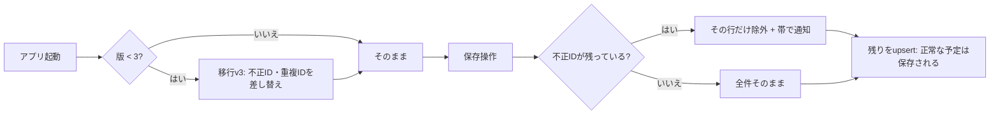

# 不正なIDで時間割の同期が黙って止まる問題を塞ぐ（改善1）

日付：2026-09-07
種別：修正
状態：完了（`feat/google-calendar-sync` ブランチにコミット。本番未反映）

## 結論

**IDの形が不正な予定が1件あるだけで、その日の時間割がまるごとクラウドに保存されなくなる**、
という壊れ方を塞いだ。3段構えで直している。

1. **移行 v3**（`SCHEMA_VERSION` を 2 → 3）が、UUIDでない時間割IDを起動時に正しい形へ直す。
2. **送信前のガード**が、それでも残った不正IDの行だけを除外し、**残りは保存されるようにする**。
   以前は1件の不正が正常な全件を道連れにしていた。
3. **除外したことは黙らせず**、画面上部の帯で本人に伝える。

なお [`docs/reports/2026-09-07-次に取り組む改善3件.md`](2026-09-07-次に取り組む改善3件.md) の
改善1に対応する。改善2・3は未着手。

## 依頼と背景

依頼は「修整を続けて」。上記レポートの優先順に従い、最優先の改善1に着手した。

### 元の症状と発生条件

- **条件**: ログイン中の利用者が、旧「次の一歩」から移行された予定を1件でも持っている。
- **症状**: 時間割（`gc.timeboxes`）のクラウド保存が毎回まるごと拒否され続ける。
  本人の操作は成功して見えるため気づけず、**別端末で開いたときに「予定が空」**で初めて発覚する。

### 原因

スキーマ移行 v2 が、旧タスクを `` `from-task-${t.id}` `` という接頭辞つきの文字列IDで
時間割へ変換していた（[`src/lib/storage.ts:238`](../../src/lib/storage.ts)）。
Supabase 側の主キーは `uuid` 型なので、この形は入らない。

本番DBで実際に確かめた結果：

```
select 'from-task-1'::uuid;
→ ERROR: 22P02: invalid input syntax for type uuid: "from-task-1"
```

そして `reconcileCollection()` は配列を**1回の `upsert` で送る**ため、
1件でも不正があるとバッチ全体が拒否される。

## 変更内容・調査結果

### 追加

| ファイル | 内容 |
|---|---|
| [`src/lib/uuid.ts`](../../src/lib/uuid.ts) | `isValidUuid()`。版・バリアントを問わないゆるい判定 |
| [`tests/uuid.test.mjs`](../../tests/uuid.test.mjs) | 通す側・弾く側の境界を9件で固定 |

版を厳密に v4 だけへ絞ると、Supabase の `gen_random_uuid()` など他所が作った
正当なUUIDまで弾いて同期が止まる。防ぎたいのは「uuid型に入らない文字列」なので、
形の一致で十分と判断した。

### 変更

| ファイル | 変更前 | 変更後 |
|---|---|---|
| [`src/lib/storage.ts`](../../src/lib/storage.ts) | `SCHEMA_VERSION = 2` | `= 3`。移行v3を追加し、不正ID・重複IDを `crypto.randomUUID()` へ差し替える |
| [`src/lib/supabase/sync.ts`](../../src/lib/supabase/sync.ts) | 配列をそのまま `upsert` | `id` 列のテーブルは不正IDの行を除外してから送り、除外を `noteFailure` で帯に出す |
| [`tests/storage.test.mjs`](../../tests/storage.test.mjs) | `crypto.randomUUID` スタブが `uuid-1` を返していた | 本物と同じUUIDの形を返す。移行v3のテスト5件を追加 |

時間割の `id` は他テーブルから参照されていない（参照は timeboxes → goal_cards / habits の
向きだけ）ので、差し替えても壊れるものは無い。中身はそのまま持ち越す。

### 判断したこと

- **除外した行のクラウド側は消さない。** 削除判定に使う `keep` は、除外前の
  全IDで作っている。除外分を外すと「ローカルで消された」とみなして
  クラウドの対応行を消してしまう。
- **`22P02` 専用の判定は追加しなかった。** レポートは提案していたが、
  ガードが送信前に弾くので `id` 経由では到達しない。
  また `describeError()` が既にエラーコードまで文字列化しており
  （`651ab9e` で修正済み）、帯には `22P02` と原因文が出る。
  到達しないコードを足さない判断をした。

### テストのスタブを直したこと（重要）

`tests/storage.test.mjs` の `crypto.randomUUID` スタブは `uuid-1` を返していた。
これは**UUIDでない文字列**で、実物の性質を守っていない。
そのため「UUIDでない値が混ざる」という今回の種類の不具合を、テストが素通ししていた。
実際、移行v3のテストは最初これで失敗し、スタブ側の欠陥に気づいた。
他のテストは `uuid-` の形に依存していなかったので、実物と同じ形を返すよう変更した。

## 仕組みの説明

利用者から見た流れ。

1. アプリを開くと、保存データの版が3より古ければ移行が走る。
2. 移行v3が時間割を1件ずつ見て、IDがUUIDの形でない、または既出のものだけを
   新しいUUIDへ差し替える。**直すものが無ければ何も書かない**
   （無用な書き込みは同期に乗ってしまうため）。
3. ログイン中なら、保存のたびに時間割がクラウドへ送られる。
   その直前に、万一残っている不正IDの行だけを外す。
4. 外した場合は画面上部の帯に「IDの形式が不正なN件を送れませんでした」と出る。
   **他の予定は正常に保存される。**



## 関連ファイル・根拠

- [`src/lib/uuid.ts`](../../src/lib/uuid.ts) — 判定本体
- [`src/lib/storage.ts`](../../src/lib/storage.ts) — 移行v2が不正IDを作る箇所と、移行v3
- [`src/lib/supabase/sync.ts`](../../src/lib/supabase/sync.ts) — `reconcileCollection()` の送信ガード
- [`tests/uuid.test.mjs`](../../tests/uuid.test.mjs) / [`tests/storage.test.mjs`](../../tests/storage.test.mjs) — 回帰の固定
- [`docs/reports/2026-09-07-次に取り組む改善3件.md`](2026-09-07-次に取り組む改善3件.md) — 今回の出典
- [`docs/reports/2026-09-06-同期が黙って止まっていた件.md`](2026-09-06-同期が黙って止まっていた件.md) — 元の事故

## 確認したこと

| 確認 | 方法 | 結果 |
|---|---|---|
| Postgres が実際に拒否するか | 本番DBで `select 'from-task-1'::uuid` | `22P02` で拒否。**推測ではなく実測** |
| 本人の現在データに不正IDがあるか | `.local-backups/latest.json` を走査 | 時間割13件すべて正常なUUID。**いま壊れてはいない** |
| 移行v3が直すか | `npm test`（移行テスト5件） | 全通過 |
| 実ブラウザでの移行 | `from-task-999` を仕込み → リロード | 版が3に上がり、IDがUUID化。件数10件・開始終了時刻とも保持 |
| 判定関数の境界 | `tests/uuid.test.mjs` 9件 | 全通過 |
| 全体の回帰 | `npm test` / `npx tsc --noEmit` | 全通過（112ファイル走査）、型エラーなし |

検証で仕込んだデータは削除し、実データ9件へ復元済み。

**未実施**: 実際にログインした状態で不正IDを含む配列を送り、帯が出て残りが保存されることの
実地確認はしていない（本番データを使う操作になるため）。ロジックは単体で確認している。

## 残っていること

- **本番に出ていない。** 作業ブランチ `feat/google-calendar-sync` はレビュー途中で `main` 未マージ。
  出典レポートも指摘しているとおり、同期の安全修正（`651ab9e`・`e9132e8`・今回）だけを
  `main` 由来の小さいブランチへ切り出して先に出す判断を、別途相談したい。
- 改善2（初回起動が空の時間割に着地し、対話への導線が無い）は未着手。
- 改善3（振り返りの文章が書き捨てになっている）は未着手。
- Vercel の環境変数が Production のみで Preview に無い状態は未解消
  （[`scripts/push-env-to-vercel.sh`](../../scripts/push-env-to-vercel.sh) を用意済み。実行は未了）。
