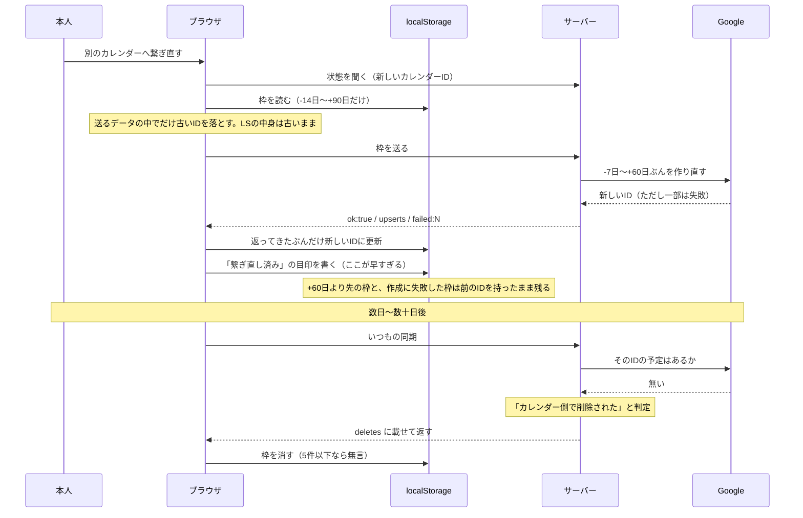

# 前日分（2026-09-07）のコードレビュー

日付：2026-09-08
種別：調査
状態：完了（コードは一切変更していない）

## 結論

2026-09-07 のコミット8件と、いま手元にある未コミット変更をレビューした。
**`npm test`（全24スイート）と `npx tsc --noEmit` はどちらも通る**。

重い順に3件。いずれも **Googleカレンダー連携**まわりで、**新規の指摘**である。

1. **カレンダーを繋ぎ直したあと、時間割の枠が「時間差で」黙って消える**
   — 前回指摘した再連携の事故は塞がれたが、塞ぎ方が「送信するデータの中だけ」なので、
   送信範囲の外にある枠と、作り直しに失敗した枠に古いIDが残る。
   残ったまま「繋ぎ直し済み」の目印が書かれるので、次からは誰も気づけない。
2. **重ね表示が、いま連携している本人にだけ永久に出ない**
   — 権限（スコープ）を増やしたのに、既に連携済みのトークンは古い権限のまま。
   Google は403を返し、その403はどこにも出ないまま握りつぶされる。
3. **保管している refresh_token の重みが変わったのに、その前提が更新されていない**
   — 「漏れても専用カレンダーしか見えない」という設計上の言い訳が、
   `calendar.readonly` を足した時点で成立しなくなっている。

未コミット変更（未保存の下書き・完了目標の習慣・目標の引き継ぎ）については、
**報告すべき問題は見つからなかった**。詳細は「未コミット変更について」に書く。

## 依頼と背景

定期タスクによる、前日分のコード変更の品質確認。

対象は 2026-09-07 00:00〜23:59（JST）の8コミット（`fa40685` 〜 `f2e4414`、うち2件はマージ）。
内訳は、前回レビューの指摘3件＋改善2件の対応（`c32f1fe`）、
Googleカレンダーの予定を時間割に重ねる新機能（`274171d`）、
過ぎた予定を時間割から完了にできない問題の修正（`f69f118`）。

未コミット変更もレビュー対象にしたが、**レビュー中に内容が変わった**（作業が進行中）。
本報告は `HEAD = f2e4414` 時点の作業ツリーを見ている。

## 調査結果

### 実行したチェック

| チェック | 結果 |
|---|---|
| `npm test` | 全24スイート通過（禁止パターン走査117ファイルを含む） |
| `npx tsc --noEmit` | エラー0 |
| Google Calendar API への実通信 | **未実施**（実データを変更しない方針のため） |
| ブラウザでの動作確認 | **実行できず**（この実行は無人セッションで、開発サーバーを起動できない） |

このため、下記3件はいずれも**コードを読んで導いた結論**であり、実機での再現はしていない。
「確認できた事実」と「未検証の推論」は各項で分けて書く。

---

### 指摘1（重度：高）繋ぎ直しのあと、時間割の枠が時間差で黙って消える

**ファイル**

- [src/components/CalendarSyncBoot.tsx:61](src/components/CalendarSyncBoot.tsx)（送信範囲での絞り込み）
- [src/components/CalendarSyncBoot.tsx:78](src/components/CalendarSyncBoot.tsx)（古いIDを落とす対象）
- [src/components/CalendarSyncBoot.tsx:114](src/components/CalendarSyncBoot.tsx)（「繋ぎ直し済み」の目印を書く）
- [src/lib/calendar/engine.ts:204](src/lib/calendar/engine.ts)（IDが見つからない＝削除された、と判定する場所）
- [src/lib/calendar/engine.ts:260](src/lib/calendar/engine.ts)（サーバー側の対象期間）
- [src/lib/calendar/decide.ts:61](src/lib/calendar/decide.ts)（削除の判断）

**確認できた事実**

`clearEventIdsIfCalendarChanged()` が古い `googleEventId` を落とすのは、
**サーバーへ送る配列の中だけ**である（`reconnect.ts` は純粋関数で、localStorage を触らない）。
localStorage 側の枠は、サーバーが**作り直しに成功して `upserts` を返してきたものだけ**が
新しいIDに書き換わる（`CalendarSyncBoot.tsx:120-131`）。

そして、送信対象は日付で絞ってある。

| どこ | 期間 |
|---|---|
| ブラウザが送る範囲 | 今日 −14日 〜 **+90日** |
| サーバーが処理する範囲（`inWindow`） | 今日 −7日 〜 **+60日** |

にもかかわらず、`data.ok` が真で `pendingDeletes` が0なら、
**「このカレンダーで同期できた」という目印（`LAST_CALENDAR_KEY`）が無条件で書かれる**。
`result.failed`（1件ずつの作成失敗の件数）は呼び出し側で一切見ていない。

**発生条件（2通り）**

1. **+60日より先の枠を持っている状態で繋ぎ直す。**
   その枠はサーバーの処理対象外なので作り直されず、localStorage には
   前のカレンダーのIDが残る。目印だけが新しいカレンダーになる。
2. **繋ぎ直しのときに、どれか1件の `insertEvent` が失敗する。**
   繋ぎ直しでは対象の全枠を一斉に作り直すので、Googleのレート制限や
   一時的な失敗を踏みやすい。失敗した枠は `result.failed++` されるだけで、
   `upserts` に載らない＝localStorage のIDは古いまま。目印は書かれる。

どちらの場合も、次回以降の同期では `previousCalendarId === currentCalendarId` になるので
**もう二度と古いIDは落とされない**。

**利用者への影響**

古いIDを持ったまま残った枠が、サーバーの処理範囲（−7〜+60日）に入った瞬間、
`eventStateOf()` が「新しいカレンダーにこのIDが無い」→ `"cancelled"`（＝カレンダー側で削除された）
と判定する。メタ認知も振り返りも書いていない枠は `deleteBox` になり、**localStorage から消える**。

5件以下なら削除ブレーキ（`DELETE_BRAKE`）も効かないので、**一言もなく消える**。
条件1では繋ぎ直しの数十日後に起きるため、原因と結果が時間的に離れていて、
本人が「カレンダーを繋ぎ直したせいだ」と気づく手がかりが無い。

**修正候補**

古いIDを落とす操作を、**送信データではなく localStorage 本体に対して**行い、
そのうえで目印を書く。順序は次のとおり。

1. カレンダーが変わったと判定したら、**全期間の**枠の `googleEventId` を localStorage 上で null にする
2. 書き込みが終わってから `LAST_CALENDAR_KEY` を更新する（送信の成否より先でよい。
   IDを落としてあるので、失敗しても次回は「作り直す」に倒れるだけで、消える方向には倒れない）
3. `result.failed > 0` のときは目印を書かない、という補強も併せて入れる

**確認方法**

`clearEventIdsIfCalendarChanged` に「+120日の枠」を混ぜ、
落とされた枠が localStorage 側にも反映されることを見る単体テストを足す。
加えて `tests/calendar-engine.test.mjs` に、
「古いカレンダーのIDを持つ枠は `deleteBox` になる」という現状の挙動を明示するテストを置き、
上の修正でそれが起きなくなることを確かめる。

---

### 指摘2（重度：中）重ね表示が、既に連携している本人にだけ永久に出ない

**ファイル**

- [src/lib/calendar/google.ts:35](src/lib/calendar/google.ts)（スコープを2つに増やした）
- [src/lib/calendar/google.ts:266](src/lib/calendar/google.ts)（`listCalendars` が失敗時に throw する）
- [src/app/api/calendar/overlay/route.ts:84](src/app/api/calendar/overlay/route.ts)（例外を握って `ok:false` にする）
- [src/app/plan/page.tsx:147](src/app/plan/page.tsx)（`ok:false` のとき `message` を見ずに黙って捨てる）

**確認できた事実**

`274171d` で `CALENDAR_SCOPE` に `calendar.readonly` を足した。
OAuth で許可された権限は **同意した時点で refresh_token に固定される**もので、
アプリ側の定数を変えても、既に保存済みのトークンには遡って付かない
（[Google OAuth 2.0 のドキュメント](https://developers.google.com/identity/protocols/oauth2/web-server)）。

新しく連携し直す経路（`/api/calendar/connect`）は無いわけではない。
だが**「連携済み」の人に再連携を促す仕組みも、権限不足を検出する仕組みも無い**。
`listCalendars()` が403で throw → ルートの `catch` が
`{ ok:false, message:"カレンダーを読めませんでした。" }` を返す →
時間割の画面は `d?.ok` が偽なので**その `message` を読まずに捨てる**。

**利用者への影響**

いちばん影響を受けるのは、**この機能を作った本人**である。
既に連携済みなので、時間割を開いても重ね表示は永久に0件のまま、
設定画面には新しい権限の説明文だけが出る。
「実装したのに動かない、理由も出ない」という状態になり、
再連携すれば直ることに自力で気づく手がかりが無い。

なお、この状態でも既存の同期（書き込み）は `calendar.app.created` だけで足りるので、
**壊れているとは分からない**。重ね表示だけが静かに欠ける。

**未検証の部分**

Google が実際に403（`insufficientPermissions`）を返すこと自体は仕様からの推論で、
実通信では確かめていない。ただし「同意時のスコープが固定される」という前提が正しければ、
`calendarList` の呼び出しが通る理由が無い。

**修正候補**

- `/api/calendar/overlay` で 401/403 を他の失敗と区別し、
  `{ ok:false, reason:"reconnect_required" }` のように返す
- 設定画面の連携ブロックに「読み取りの許可が足りません。連携し直してください」を出す
- 併せて、`saveLink()` の時点で **Google が返した `scope` を保存**しておき、
  必要なスコープが揃っているかをコード側で判定できるようにする（推測に頼らなくなる）

**確認方法**

`link` の refresh_token を意図的に古いスコープのものに差し替えて
`/api/calendar/overlay?date=YYYY-MM-DD` を叩き、
403 が `reason` として画面まで届くことを見る。単体では `listCalendars` を
403 で throw するモックに差し替えたルートのテストで足りる。

---

### 指摘3（重度：中）保管している refresh_token の重みが変わったのに、前提が更新されていない

**ファイル**

- [src/lib/calendar/link.ts:7](src/lib/calendar/link.ts)（コメントに書かれた設計上の前提）
- [src/lib/calendar/google.ts:15](src/lib/calendar/google.ts)（同じ趣旨の記述）

**確認できた事実**

`link.ts` の先頭には、`refresh_token` を Supabase に保管してよい理由として

> スコープを calendar.app.created に絞ってあるため、万一漏れても
> 露出するのはアプリが作った専用カレンダー（＝アプリが既に持つ情報）だけ。

と書いてある。`274171d` で `calendar.readonly` を足したので、**この前提はもう成立しない**。
いまの refresh_token は、本人の**すべてのカレンダーの全予定を読める鍵**である。
`google.ts` 側の「万一トークンが漏れても、本人のカレンダーが壊されることはない」も、
**書き換えられない**は正しいが**読まれない**とは言えなくなった。

権限の入口そのものは、調べた範囲では塞がっている。
`loadLink()` はログイン中のユーザーに紐づくので（`link.ts:29-34`）、
`REQUIRE_AUTH` が未設定でも、未ログインの第三者が
`/api/calendar/overlay` から他人の予定を読むことはできない（`user` が null → `events: []`）。
**いま実在する漏洩経路は見つからなかった。** 問題は、鍵の価値が上がったことが
どこにも記録されていない点である。

**利用者への影響**

直接の影響は無い。ただし、この判断の記録が古いままだと、
今後 Supabase のRLSやキー管理を検討するときに
「大した鍵じゃない」という誤った前提で判断してしまう。
`AGENTS.md` が localStorage の中身について同じ趣旨の警告を置いているのと同じ理由で、
**設計上の言い訳は、前提が変わったときに必ず書き換える**必要がある。

**修正候補**

- `link.ts` / `google.ts` のコメントを、いまのスコープに合わせて書き直す
- `google_calendar_links` テーブルの RLS が「本人の行しか読めない」ことを一度確認し、
  その結果を `AGENTS.md` か報告に残す（今回は実DBを触らない方針のため未確認）

**確認方法**

コメントの修正なので機械的な検証は無い。RLS の確認は Supabase の
`google_calendar_links` のポリシー一覧を読めば足りる。

---

### 未コミット変更について

`HEAD = f2e4414` 時点の作業ツリーには、次の変更があった（コードは変更していない）。

- 「手入力でつくる」を押しただけで空の目標が枠を占める問題を、sessionStorage の下書きに変える
- 「＋ 繰り返すことを足す」を押しただけで空の習慣が保存される問題を、画面上の下書きに変える
- 目標を完了にしたら、その習慣を時間割・今日のチェックリストから外す（`habitsOfActiveCards`）
- 完了した目標に紐づく予定を開いたとき、プルダウンが「（紐づけない）」に見えてしまう食い違いを直す（`goalSelectOptions`）
- 目標画面から `/plan?card=<id>` で目標を引き継ぐ
- リスト表示で習慣の枠が必ず末尾に来ていたのを時刻順に直す（`sortByStart`）
- 目標を消すときに、巻き添えになる予定・習慣の件数を出す

**報告すべき問題は見つからなかった。** 特に次の2つは、レビューの過程で危険だと考えた点だが、
どちらも既に手当てされていることを確認した。

- `peekPendingCard()` は下書きを**消さずに覗く**ようになっており、
  React StrictMode で effect が2回走っても「目標が見つかりませんでした」に落ちない
  （[src/lib/goal-card.ts](src/lib/goal-card.ts) のコメントに理由も書かれている）
- 目標がまだ未保存のまま習慣だけ保存されると、どこからも辿れない習慣が残るが、
  `HabitEditor` の `onChange` が `persistDraft()` を先に呼ぶ
  （[src/app/goal/\[id\]/page.tsx](src/app/goal/[id]/page.tsx) の `HabitEditor` 呼び出し）

軽微な点として、`upsertHabit()` が `persistDraft()` より先に走るため、
Supabase へは「目標より先に習慣」が飛ぶ順序になっている。
外部キー違反になれば `healIfDanglingReference()` が拾って直すので実害は無いが、
そのとき一瞬「クラウドへの保存が止まっています」の帯が出る可能性はある。
localStorage 側は同じ処理の中で整合しているので、データは失われない。

### 前回の指摘の追跡

`docs/reports/2026-09-07-前日分コードレビュー.md` の3件は、いずれも `c32f1fe` で対応済み。

| 前回の指摘 | いまの状態 |
|---|---|
| 同期エラーの帯が消えない／閉じたら戻らない | `clearFailure()` と `syncBarKey()` で解消。総当たり10件のテストあり |
| 再連携で時間割が削除される | 主経路は塞がれた。**残った穴が上の指摘1** |
| 24:00 に終わる枠がカレンダーと噛み合わない | `toRfc3339` / `foldEndToSameDay` で送受両方向を揃えて解消 |

### 規約との照らし合わせ（軽微）

`AGENTS.md` は「APIルートの入力は必ず `src/lib/api-schema.ts` の zod スキーマを通す」と定めているが、
`/api/calendar/overlay` は `DATE_RE` でインラインに検証している
（[src/app/api/calendar/overlay/route.ts:11](src/app/api/calendar/overlay/route.ts)）。
検証そのものは十分に厳しく、日付以外の文字列で Google を叩かせない目的は達している。
**実害は無いが、規約どおりなら zod 側に置き場所を移すのが筋である。**

## 仕組みの説明

指摘1が起きるまでの流れを、操作の順に書く。

要点は、**古いIDを落とす操作と、「落とし終わった」という記録が、別の場所を指している**ことである。
落としたのは送信データ（一時的なコピー）で、記録したのは「localStorage も片付いた」という意味の目印だった。

## 関連ファイル・根拠

| ファイル | 役割 |
|---|---|
| [src/components/CalendarSyncBoot.tsx](src/components/CalendarSyncBoot.tsx) | 時間割を開いたときの同期。指摘1の発生源 |
| [src/lib/calendar/reconnect.ts](src/lib/calendar/reconnect.ts) | 繋ぎ直しの検知。純粋関数なので localStorage は触らない |
| [src/lib/calendar/engine.ts](src/lib/calendar/engine.ts) | 同期本体。`eventStateOf`(204) と `inWindow`(260) が指摘1の判定 |
| [src/lib/calendar/decide.ts](src/lib/calendar/decide.ts) | 消す／作る／更新するの判断表 |
| [src/lib/calendar/google.ts](src/lib/calendar/google.ts) | Google API の薄い包み。スコープ定義が指摘2・3の起点 |
| [src/app/api/calendar/overlay/route.ts](src/app/api/calendar/overlay/route.ts) | 重ね表示の読み取り専用API。指摘2の握りつぶし箇所 |
| [src/lib/calendar/link.ts](src/lib/calendar/link.ts) | 連携情報の読み書き。指摘3のコメントがここ |
| [src/lib/goal-card.ts](src/lib/goal-card.ts) | 未コミット変更。下書きと目標プルダウン |
| [docs/reports/2026-09-07-前日分コードレビュー.md](docs/reports/2026-09-07-前日分コードレビュー.md) | 前回の指摘（追跡表の元） |

## 確認したこと

- `npm test` … 全24スイート通過。失敗は1件も無い
- `npx tsc --noEmit` … エラー0
- `tests/forbidden.test.mjs` … 117ファイルを走査して禁止パターンなし
  （`dangerouslySetInnerHTML` / `innerHTML =` / `eval` / `NEXT_PUBLIC_` の鍵、いずれも無し）
- 未コミット変更について、StrictMode での二重実行と、未保存目標に紐づく孤児の習慣を
  コード上で追い、どちらも手当て済みであることを確認した
- 指摘1の判定経路（`eventStateOf` → `decideCalendarAction` → `deleteBox`）を
  コードとテストの両方で追い、`googleEventId` があって取得結果に無い枠が
  削除されることを確認した

**実施できなかったこと**

- ブラウザでの動作確認。この実行は無人の定期タスクなので、開発サーバーを起動できない
- Google Calendar API と Supabase への実通信。実データを変更しない方針のため
- `npm run build`。テストと型チェックが通り、この日の変更がビルド固有の機能
  （画像・フォント・静的生成）に触れていないため省いた

## 残っていること

- 指摘1〜3はいずれも**未修正**。この報告は調査だけで、コードは変更していない
- 指摘2の403は仕様からの推論であり、実通信では確かめていない。
  再連携すれば直るかどうかは、実際に一度繋ぎ直せば分かる
- `google_calendar_links` の RLS は未確認（指摘3の修正候補に含めた）
- 未コミット変更はレビュー中も更新されていた。コミット時点でもう一度見るのが望ましい
