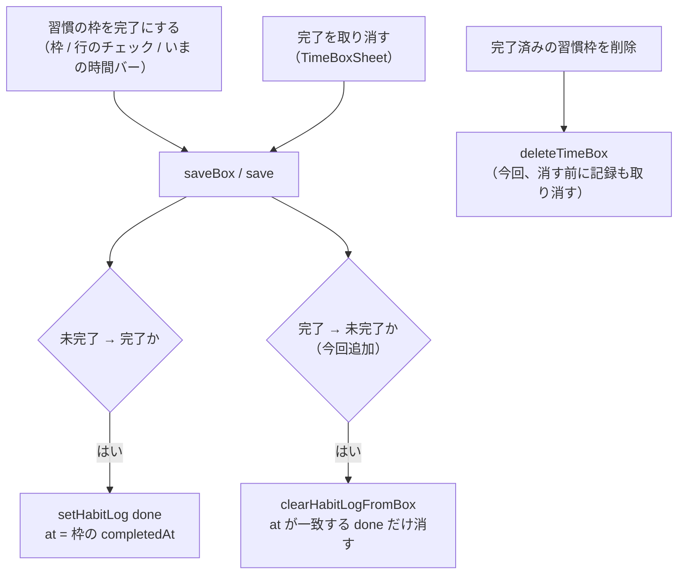

# 次に取り組む改善3件と、完了取り消しの修正（2026-09-11 その2）

日付：2026-09-11
種別：調査・提案（改善1は修正まで実施）
状態：改善1は修正・テスト・main へ push 済み。改善2・3 は判断待ちで残件へ

## 結論

直近7日のコミット・未コミット変更（なし）・`残件.md`・`docs/reports/` 直近分を
突き合わせた。**過去の提案はすべて実装済みか、判断待ちとして正しく `残件.md` に
残っている**。今回あらためてコアの流れ（対話 → 時間割・習慣・振り返り）を
読み直したところ、**未報告の不具合を1件見つけた**ので直した。

| # | 改善 | 中心価値 | 規模 | 今回の扱い |
|---|------|---------|------|-----------|
| 1 | 予定の完了を取り消しても、習慣の「できた」が残り続け、連続日数と達成率が水増しされる | 習慣化の手応えが**嘘をつかない**こと | 小 | **直した（main へ push）** |
| 2 | `woop_wbs` のターン上限が、問い直し1回で「いつ・どこで」を取り切れず強制完了しうる（R10） | 対話の唯一の持ち帰りを捨てない | 小 | 判断待ち（対話が長くなる）。`残件.md` R10 |
| 3 | 未ログイン利用者に「この端末にしか残っていない」ことと書き出し導線が届いていない（R11） | データ消失の予防 | 小 | 判断待ち（画面に要素が増える）。`残件.md` R11 |

改善2・3 は 2026-09-10 の調査で詰めて `残件.md` に載せた標準の判断待ちで、
今回は蒸し返さない。**竜一の一言（R10 は「7→10 でよい／値を変える／今はやらない」、
R11 は「案A で出す／出さない」）が来れば、どちらもその場で実装できる。**

---

## 改善1（実施済み）: 完了を取り消しても、習慣の記録が残り続ける

### 現在の問題

**時刻を決めた習慣（毎朝6時に腕立て、など）を持つ利用者**が、時間割や「今日」の
画面でその枠を **完了 → やっぱり取り消し**（`完了を取り消す`）とすると、
枠の完了マークは外れるのに、**習慣の「できた」記録はその日に残り続ける**。

- `/me` の連続日数と「いまのところ N 日続いています」が、やっていない日を
  1日分多く数える。直近30日の達成率も同じだけ水増しされる。
- 時刻を持つ習慣は「今日の習慣」チェックリストに**出ない**（時間割の枠として
  並ぶため。`list/page.tsx` の `todayHabits` は `!canPlace(h)` で絞る）ので、
  **その「できた」を後から取り消す手立てが画面上にない**。
- 完了済みの習慣枠を**削除**したときも同じ。枠は消えるが記録は残り、
  次に画面を開くと習慣からまた未完了の枠が起きてくる（`habitBoxesOn` は
  常に `completedAt: null` で起こす）ため、**枠は「未完了」・記録は「できた」**
  という食い違った状態になる。

`src/types/behavior.ts` は「done / missed を安易に切り替えると達成率が理不尽に
動く」を型コメントで警告している。ここはその逆で、**やっていないのに done が
残る**——「続いているのに途切れたと言われる」と並んで、習慣アプリでいちばん
信用を失う壊れ方（今回は逆方向の嘘）。

### 根拠

- `src/app/list/page.tsx` `saveBox()` / `src/app/plan/page.tsx` `save()` …
  どちらも **未完了 → 完了に変わった瞬間だけ** `setHabitLog({state:"done"})` を
  書く（`real.habitId && real.completedAt && !before?.completedAt`）。
  **逆向き（完了 → 未完了）の分岐が無い。**
- `src/components/TimeBoxSheet.tsx:116` `uncomplete()` … `patch({ completedAt: null })`
  を呼ぶだけ。`patch` は `onSave` 経由で上の `saveBox` / `save` に届くが、
  そこに戻す処理が無いので記録はそのまま。
- `src/lib/storage.ts` `deleteTimeBox()` … 枠を配列から外すだけ。
  習慣枠かどうかも、完了済みかどうかも見ていなかった。
- `src/lib/habit.ts` `computeStreak` / `computeRate` … `findLog` が
  その日の `done` を拾う。**記録が消えれば正しく「今日はまだ」に戻る**
  （`i === 0 && !log` を分母から外す既存分岐）。つまり直し方は
  「余計な記録を消す」だけでよく、集計側は触らなくてよい。
- `/me`（`src/app/me/page.tsx`）は習慣を記録する UI を持たない。
  時刻付き習慣の `done` を生む経路は、事実上この枠の完了だけ。

### 直した内容（最小限）

`completedAt` を戻すのと**対称**に、その枠がさっき自動で付けた記録だけを取り消す。

1. `src/lib/storage.ts` に `clearHabitLogFromBox(habitId, date, at)` を追加。
   消すのは **`state === "done"` かつ `at`（実際に押した時刻）が枠の
   `completedAt` と一致するもの**だけ。手で付けた記録・`partial` /
   `skipped` / `missed` には触れない。
   「`completedAt` を null に戻すと記録ごと消える」という Task 側の壊れ方を
   繰り返さないため、対象をここまで厳しく絞った。
2. `list/page.tsx` `saveBox()` と `plan/page.tsx` `save()` に、
   `setHabitLog` と対称の分岐を1つずつ追加
   （`real.habitId && !real.completedAt && before?.completedAt` のとき
   `clearHabitLogFromBox`）。
3. `deleteTimeBox()` は、消す前に対象の枠を引き、
   **完了済みの習慣枠なら** `clearHabitLogFromBox` を呼ぶ。
   目標ごと消す `deleteTimeBoxesOfCard` 経由は、既存の
   「消えた習慣の記録を全部落とす」処理（`storage.ts:717`）が面倒を見るので触らない。

集計ロジック（`habit.ts`）・型・同期のマッパーは変更なし。
`habit_logs` の削除は `reconcileHabitLogs`（`sync.ts:299`）が既に扱うので、
`write()` 経由でそのままクラウドにも伝わる。

### 優先した理由

- **習慣は3本柱の1つ**で、その数字が信用できないと続ける動機そのものが崩れる。
- 押し間違いは日常的に起きるのに、**取り消す手立てが無い**のが特に悪い。
- 変更は小さく（実質 add が中心）、集計側に触れないので回帰リスクが低い。
- 純粋に近い関数なので `tests/` で固定できる。

### 完了条件

- [x] 習慣枠を完了 → 取り消しすると、その日の `done` 記録も消える。
- [x] 手で付けた記録（時刻が枠の完了時刻と一致しない）は消えない。
- [x] 完了済みの習慣枠を削除しても記録が残らない。習慣に紐づかない枠では何もしない。
- [x] `npm test`（全25スイート）・`npx tsc --noEmit`・`npm run build` が通る。

### 確認方法

- 単体：`tests/storage.test.mjs` に7件追加。
  - `clearHabitLogFromBox` … 一致する `done` を消す／時刻違いは守る／
    `done` 以外は触らない／記録が無くても落ちない
  - `deleteTimeBox` … 完了済み習慣枠で記録を消す／未完了なら消さない／
    習慣に紐づかない完了済み枠では触らない
  - このうち「`deleteTimeBox` が完了済み習慣枠の記録を消す」は、
    今回の関数が無ければ通らない（修正前のコードに対する回帰テスト）。
- ブラウザ：**未実施**。無人セッションでは開発サーバーを起動できない方針
  （`残件.md` の従来どおり）。手順は「習慣を作る → 6時の枠を完了 →
  `/me` で連続1日 → 枠を開いて取り消し → `/me` が『今日はまだ』に戻る」。

### 規模

**小**。変更対象：`src/lib/storage.ts`、`src/app/list/page.tsx`、
`src/app/plan/page.tsx`、`tests/storage.test.mjs`。

---

## 改善2（判断待ち・R10）: woop_wbs のターン上限

2026-09-10 の調査（[docs/reports/2026-09-10-次に取り組む改善3件.md](2026-09-10-%E6%AC%A1%E3%81%AB%E5%8F%96%E3%82%8A%E7%B5%84%E3%82%80%E6%94%B9%E5%96%843%E4%BB%B6.md) 改善1）で
詰めたものがそのまま残っている。`src/types/goal.ts` の
`PHASE_TURN_LIMIT.woop_wbs = 7` は、口火（ユーザー未回答で1ターン消費）＋
「障害・状況・If-Then・タスク選び・いつ・どこで」の6答でちょうど埋まる。
指示文（`src/lib/prompts/phases.ts:161-193`）が前提にしている問い直しが
1回でも入ると、「どこで」を答え切る前に `resolvePhase` が `forced` で打ち切り、
`card/page.tsx` が時刻 `21:00` の既定・場所なしで「明日の一歩」の枠を作る
（`src/app/card/page.tsx:201`）。

**なぜ今回も自動で入れなかったか**：上限を上げると対話が長くなり、
`docs/mvp-spec.md` の「離脱の最大要因は『思ったより長い』」と綱引きになる。
値はUXの判断で、効果の確認も対話1本＝課金（`残件.md` R5）が要る。

**推奨**：`7 → 10`（問い直し約3回ぶん）＋ `tests/phase-machine.test.mjs` に
上限を固定する回帰テスト。small フローの最大は 16 → 19 ターンで、
廃止した5フェーズ39ターンの半分に収まる。

---

## 改善3（判断待ち・R11）: 未ログイン利用者への書き出し導線

こちらも 2026-09-10 の調査（改善2・案A）から動いていない。
デプロイ環境で未ログインの間、`LocalBackupBoot` のディスク書き込みは効かず
（`AGENTS.md` 明記の dev 専用）、Supabase 同期も `off`。書き出しは「設定」の
下部にしかなく、`/me` から4手先。`AGENTS.md` は localStorage が丸ごと消えた
実データ喪失の実例を記録している。

**推奨（案A）**：`/me` のログインCTA直下に、**未ログイン かつ 中身がある**
ときだけ「データはこの端末にしか残りません。ときどき書き出して保管を」＋
「いま書き出す」ボタン。`captureState()` / `download()` は既存なので表示分岐だけ。

---

## 仕組みの説明（改善1）

`clearHabitLogFromBox` の絞り込みが肝。**「この枠がさっき書いた done」**
＝ `state === "done"` かつ `at === 枠の completedAt` のときだけ行を消す。
これで「手で付けた記録が、無関係な枠の操作で消える」事故を防ぐ。

## 関連ファイル

| ファイル | 役割 |
|---|---|
| [src/lib/storage.ts](../../src/lib/storage.ts) | `clearHabitLogFromBox()` 追加、`deleteTimeBox()` に取り消しを追加 |
| [src/app/list/page.tsx](../../src/app/list/page.tsx) | `saveBox()` に完了取り消しの分岐 |
| [src/app/plan/page.tsx](../../src/app/plan/page.tsx) | `save()` に完了取り消しの分岐 |
| [src/components/TimeBoxSheet.tsx](../../src/components/TimeBoxSheet.tsx) | `uncomplete()`（呼び出し元。変更なし） |
| [src/lib/habit.ts](../../src/lib/habit.ts) | `computeStreak` / `computeRate`（記録が消えれば自動で正しくなる。変更なし） |
| [tests/storage.test.mjs](../../tests/storage.test.mjs) | 回帰7件 |

## 確認したこと

| チェック | 結果 |
|---|---|
| `npm test`（全25スイート） | 通過（`storage` は 35 → 42 件） |
| `npx tsc --noEmit` | エラー0 |
| `npm run build` | 成功（全ルート） |
| 修正前コードで新テストが落ちるか | 「`deleteTimeBox` が完了済み習慣枠の記録を消す」は関数が無いと通らない＝回帰を捕まえる |
| ブラウザでの操作 | 未実施（無人セッションで dev サーバーを起動しない方針） |
| Google / Supabase への実通信 | 未実施 |

## 残っていること

- **改善2（R10）・改善3（R11）** … 判断待ち。上に推奨を書いた。
- `残件.md` の他の判断待ち（R1 呼び名の一覧表示、R2' 作成日を数えるか、
  R3 マージ済みブランチ、R12 繋ぎ直しの誤爆ガード）と、
  本人の操作が要る未検証（R5 対話の通し、R6 本番の同期往復、R7 本番の鍵）は
  今回も動かしていない。
- 改善1の周辺で、直していない細かい食い違いが1つある：
  **完了済みの習慣枠を別の日へドラッグ移動**すると、記録は元の日に、枠は
  新しい日に残る。稀で、実装が煩雑になるため今回は見送った。`残件.md` R13 に記載。
