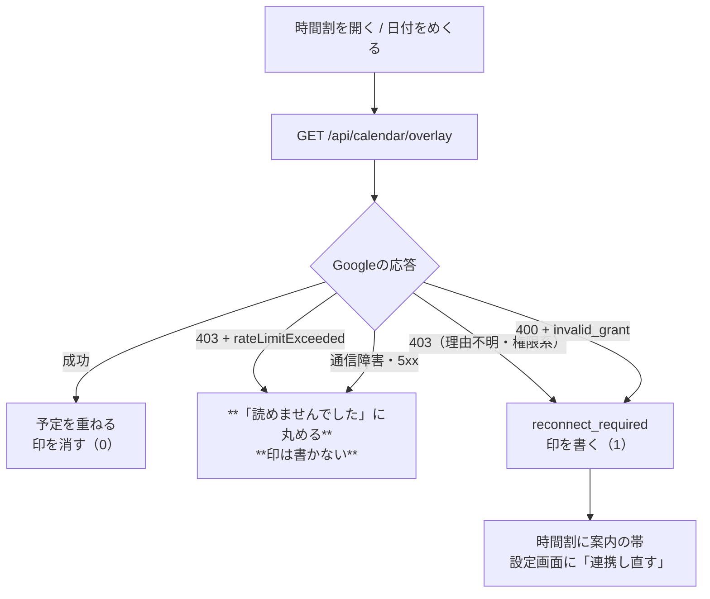

# 止まっていたタスクの棚卸しと修正（2026-09-11）

日付：2026-09-11
種別：修正（＋棚卸しの調査）
状態：完了（判断待ちの5件は手を付けずに残した）

## 結論

止まっていたものを全部並べ直したところ、**「判断が要らない不具合」は2件だけ**だった。
どちらも前日のコードレビュー（`docs/reports/2026-09-10-前日分コードレビュー.md`）が
指摘して、報告に書かれたまま修正が入っていなかったもの。この2件を直した。

1. **混んでいるだけなのに「連携し直してください」と出て、しかも消えなくなる**問題を直した
2. **繋ぎ直しの後始末が途中で失敗しても「片付いた」印だけ残る**問題を直した

残りの5件（R1・R2'・R3・R10・R11）は、**どれも「どちらが正しいか」を決める話**で、
実装で決めてよいものではないため、`残件.md` にそのまま残してある。
R5・R6・R7 は本人の操作（課金の発生する対話、Googleへの権限付与、`vercel login`）が
要るので、こちらも動かせない。

実際にブラウザで操作して、直した先の画面（時間割の案内・設定画面・保存失敗の帯）まで
確かめた。`npm test`（全25スイート）・`npx tsc --noEmit`・`npm run build` は通る。

---

## 依頼と背景

「止まっているタスクを並べ、判断の要らないものは自分で直し、直したら実際に動かして
確かめ、判断が要るものは残す」。

止まっていたものの一覧は次のとおり。**「判断が要るか」で二つに割れる。**

| | 内容 | 今回の扱い |
|---|---|---|
| 指摘1 | `needsReconnect()` が 403 を一律「再連携で直る」と判定する | **直した** |
| 指摘2 | 繋ぎ直しの後始末が部分失敗しても目印を書く | **直した** |
| R1 | 「短い呼び名」を目標一覧でも使うか | 判断待ち（案Bを推奨） |
| R2' | 習慣を作った当日の「できた」を連続日数に数えるか | 判断待ち（案Cを推奨） |
| R3 | マージ済みブランチ7本を消すか | 判断待ち（消すのは戻せない） |
| R10 | `woop_wbs` のターン上限を 7 → 10 にするか | 判断待ち（対話が長くなる） |
| R11 | 未ログインの人に書き出しを促す表示を足すか | 判断待ち（画面に要素が増える） |
| R5・R6・R7 | 対話の通し・本番の同期往復・本番の鍵の設定 | 本人の操作が要る |

---

## 変更内容

### 1. 混雑による403を「再連携が要る」と誤判定しない（レビュー指摘1）

**何が起きていたか**

Googleカレンダーの重ね表示が失敗したとき、`needsReconnect()` は
**HTTPステータスが 401 か 403 かだけ**で「連携し直せば直る失敗」を判定していた。
ここには2つの穴があった。

- Google Calendar API は**混雑・回数制限も 403 で返す**
  （`rateLimitExceeded` / `userRateLimitExceeded`。429 に統一されていない。
  [Google の公式エラー一覧](https://developers.google.com/workspace/calendar/api/guides/errors)）。
  重ね表示は1回の描画でカレンダー一覧1回＋予定を最大8回読むので、
  時間割の日付を素早くめくると往復が集中して踏みうる。
- 逆に、**再連携がいちばん必要な `invalid_grant`**（本人がGoogle側でアクセスを
  取り消した／トークンの期限切れ）は OAuth の規約どおり **400** で返ってくる
  （[RFC 6749 §5.2](https://datatracker.ietf.org/doc/html/rfc6749#section-5.2)）。
  ステータスだけ見ていたので、これは拾えていなかった。

前者の実害が大きい。案内を受け取った時間割の画面は
`gc.calendarNeedsReconnect` を localStorage に書き、**次に重ね表示が成功するまで
消さない**。混んでいただけなのに「読み取りの許可が足りません。連携し直してください」が
時間割と設定画面に居座り、連携し直しても消えない。案内そのものが信用されなくなる。

**どう直したか**

失敗したレスポンスの本文から「理由」を読み、`GoogleApiError` に持たせるようにした。

```ts
// 混雑・クォータ・一時的な不調。403 で来るが再連携では直らない
const RETRYABLE_403_REASONS = new Set([
  "rateLimitExceeded", "userRateLimitExceeded", "quotaExceeded",
  "dailyLimitExceeded", "variableTermExpiredDailyExceeded",
  "backendError", "RESOURCE_EXHAUSTED", "UNAVAILABLE", "INTERNAL",
]);

export function needsReconnect(err: unknown): boolean {
  if (!(err instanceof GoogleApiError)) return false;
  if (err.reason && RECONNECT_OAUTH_ERRORS.has(err.reason)) return true; // invalid_grant
  if (err.status === 401) return true;
  if (err.status !== 403) return false;
  return !(err.reason !== null && RETRYABLE_403_REASONS.has(err.reason));
}
```

**レビューの提案（「403 かつ権限系の理由」だけを true にする許可リスト方式）は採らなかった。**
Google が権限不足を返すときの理由文字列は `insufficientPermissions` /
`ACCESS_TOKEN_SCOPE_INSUFFICIENT` / `forbidden` と揺れていて、許可リストだと
**本当に再連携が要る403を取りこぼす**。取りこぼしは「案内が出ない＝従来と同じ」で
済むが、誤検知は「消えない嘘の案内が端末に焼き付く」ので、害の大きいほうを塞いだ。
**理由が読めなかった403は、これまでどおり権限不足側に倒れる。**

### 2. 落とし切れなかったら「片付いた」印を書かない（レビュー指摘2）

**何が起きていたか**

別のカレンダーへ繋ぎ直すと、`applyCalendarReconnect()` が localStorage 上の
古い予定IDを全件落とし、最後に「この端末は新カレンダーで揃えた」という目印を書く。

ところが `localStorage` への保存（`write()`）は容量超過を**握りつぶして false を
返すだけで、例外を投げない**。落とすループの中で1件でも黙って失敗すると、
古いIDが残ったまま目印だけが新しくなる。目印が新しくなった以上、
次回以降は「変わっていない」と判断されて**二度とやり直されない**。
残った古いIDがサーバーの処理窓（-7〜+60日）に入った日に「カレンダー側で削除された」と
誤判定され、**繋ぎ直しの数十日後に時間割の枠が一言もなく消える**。
この関数が塞いだはずの穴と、まったく同じ形が再発する。

**どう直したか**

- `upsertTimeBox()` が**保存できたかを返す**ようにした（`write()` の戻り値をそのまま返す）。
  画面からの保存は今までどおり戻り値を無視してよい（失敗は画面上部の帯に出る）。
- `applyCalendarReconnect()` は `save()` が `false` を返した件数を数え、
  **1件でもあれば目印を書かない**。書かなければ次に時間割を開いたときにやり直せる。
  戻り値を返さない実装（`void`）は今までどおり成功扱いなので、既存の呼び出しは壊れない。
- 落とし切れなかった件数は `ReconnectOutcome.failed` として返し、
  `CalendarSyncBoot` がコンソールに残す。送信自体は続ける
  （古いIDが残った枠は作り直されず、次回の再試行に回るだけで、悪化はしない）。

**レビューが挙げたもう一方の案**（誤爆したときに全期間・回復不能でIDが飛ぶのを、
送信窓の中だけに限定する）は入れていない。これは「`/api/calendar/status` の
`calendarId` をどこまで信用するか」という設計判断で、
レビュー自身も「設計判断として残す」としているため。`残件.md` に R12 として足した。

---

## 仕組みの説明

重ね表示が失敗したときに、画面に何が出るかの流れ。**太字が今回変わったところ。**



変更前は、真ん中の「混んでいるだけ」の枝が F（案内を出して印を焼き付ける）に流れ込み、
`invalid_grant` の枝は E（何も出ない）に流れていた。**両方とも行き先が逆だった。**

---

## 関連ファイル

| ファイル | 役割 |
|---|---|
| [src/lib/calendar/google.ts](../../src/lib/calendar/google.ts) | `GoogleApiError.reason` の追加、本文からの理由読み取り、`needsReconnect()` の判定 |
| [src/lib/calendar/reconnect.ts](../../src/lib/calendar/reconnect.ts) | 部分失敗のときに目印を書かない。`ReconnectOutcome.failed` |
| [src/lib/storage.ts](../../src/lib/storage.ts) | `upsertTimeBox()` が保存の成否を返すようにした |
| [src/components/CalendarSyncBoot.tsx](../../src/components/CalendarSyncBoot.tsx) | 落とし切れなかった件数をコンソールに出す |
| [tests/calendar-overlay.test.mjs](../../tests/calendar-overlay.test.mjs) | 指摘1の回帰6件（うち実レスポンス読み取り2件） |
| [tests/calendar-reconnect.test.mjs](../../tests/calendar-reconnect.test.mjs) | 指摘2の回帰4件 |

---

## 確認したこと

### 回帰テストが「直す前に落ちる」ことを確かめた

足したテストが本当に不具合を捕まえているかを、修正前のコードに当てて確認した。

| テスト | 修正前 | 修正後 |
|---|---|---|
| `tests/calendar-overlay.test.mjs` | **5件 失敗** / 19件 通過 | 24件 通過 |
| `tests/calendar-reconnect.test.mjs` | **4件 失敗** / 13件 通過 | 17件 通過 |

落ちた内訳は「403のレート制限を再連携扱いにしてしまう」「invalid_grant を拾えない」
「本文から理由を読めていない」「落とせなかった枠があっても目印を書く」。

### 機械的なチェック

| チェック | 結果 |
|---|---|
| `npm test`（全25スイート） | 通過（数を出すスイートの合計416件。ほかに MCP 系5スイートと、禁止パターン走査118ファイル） |
| `npx tsc --noEmit` | エラー0 |
| `npm run build` | 成功（全ルート） |

### ブラウザで実際に操作した

`npm run dev`（port 3000）に、架空のテストデータ（目標「副業」1件・習慣1件・
記録6日ぶん・予定1件）を入れて操作した。**本人の実データは使っていない。**
確認後に消し、開発用のディスクバックアップ（`.local-backups/`、gitignore 済み）も
テスト前の状態へ戻してある。コンソールエラーは最後まで0件。

- **時間割**：枠が2つ描かれ、習慣が 06:00 の枠として自動で並ぶ。
  枠を開くと目標の選択肢に短い呼び名「副業」が出て、メタ認知の「対策は」に
  習慣の場所（`場所: 自室の机`）が載る（9/10 の修正が効いている）
- **枠の編集**：題名と終了時刻を変えて閉じると localStorage に反映される
  （`upsertTimeBox()` の戻り値を増やしても保存経路は壊れていない）
- **保存に失敗したとき**：`localStorage.setItem` を意図的に失敗させると、
  値は書き換わらず、画面上部に「保存できませんでした（gc.timeboxes）」の帯が出て、
  アプリは落ちない。**この false が、今回 `applyCalendarReconnect` が読むようにした信号**
- **一覧・目標・わたし**：`/list` は時刻順に2件、`/goals` は今週の合計時間と次の予定、
  `/me` は「6日続いています」（記録6日ぶんと一致）。空データに戻しても落ちない
- **再連携の案内（3通りを実機で確認）**：重ね表示APIの応答を差し替えて、
  時間割の画面が印と帯をどう扱うかを通しで見た

  | 応答 | `gc.calendarNeedsReconnect` | 画面 |
  |---|---|---|
  | `{ok:false, message:...}`（**混雑403は今後こちら**） | `0` のまま | 帯は出ない |
  | `{ok:false, reason:"reconnect_required"}` | `1` になる | 「Googleカレンダーを読む許可が足りない…」の帯 |
  | `{ok:true, events:[...]}` | `0` に戻る | 帯が消え、予定が重なる |

### 確認していないこと

- **Googleへの実通信はしていない。** 403 のレート制限や `invalid_grant` が
  実際にどの文字列で返るかは、公式ドキュメントと RFC に基づく判断で、
  本物の応答では確かめていない。本文の読み取り自体は、応答を模したテストで固定してある
- **設定画面の「読み取りの許可が足りません」ブロックは、今回も実画面に出せていない。**
  原因を特定した：`CalendarLink` は**Supabaseにログインしていないと、カレンダーの
  状態を取りに行く手前で「先にログインしてください」に分岐する**
  （[src/components/CalendarLink.tsx](../../src/components/CalendarLink.tsx)）。
  ログインを代行できないので、ここは本人の操作でしか埋まらない（`残件.md` R6）
- ログイン中のクラウド同期・カレンダーの実往復（`残件.md` R6・R7）

---

## 残っていること

`残件.md` を更新した。**判断待ちは R1・R2'・R3・R10・R11 の5件**（今回は手を付けていない）、
**未検証は R5・R6・R7**、そして今回のレビューから **R12 を1件足した**。

- **R12（新規）**：繋ぎ直しの誤爆ガード。`/api/calendar/status` が想定外の
  `calendarId` を返したときに全期間のIDを落として回復不能になる件。
  部分失敗のほうは今回直したが、こちらは「status をどこまで信用するか」の設計判断
- 今回気づいた点として、書き込み側（`insertEvent` / `patchEvent` / `deleteEvent` /
  `createCalendar`）は素の `Error` を投げるので、**同期の失敗はどれだけ権限が
  足りなくても再連携の案内に繋がらない**。これは不具合というより
  「案内を出す範囲をどこまで広げるか」の話なので、R12 の中に併記した
