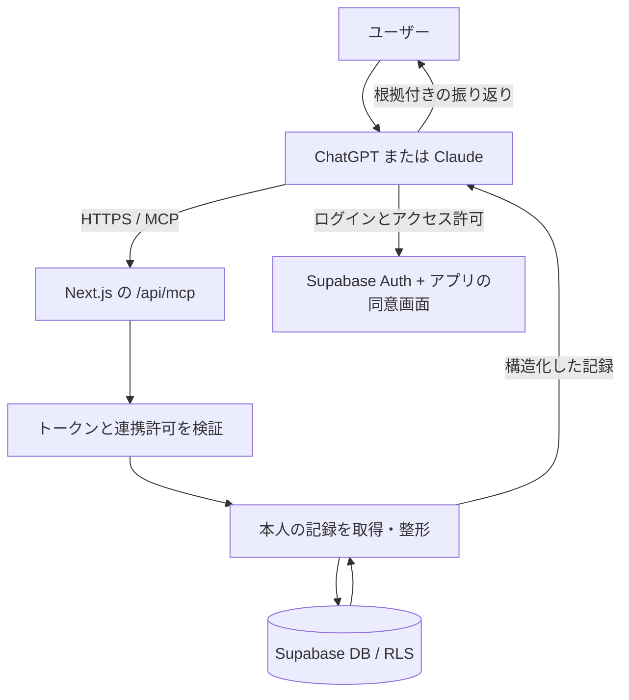

# ChatGPT・Claudeから行動記録を読むMCP連携 設計書

作成日：2026-09-06
状態：実装前の設計案。コード調査と公式資料に基づく。実環境のDB設定・OAuth設定・接続先アカウントでの動作は未検証。

## 1. 何ができるようになるか

ユーザーが普段使っているChatGPTやClaudeで「今週の自分を振り返って」と話すと、このアプリに保存した目標・習慣・時間割・振り返りメモを取得し、それを根拠に回答できるようにする。

MCPサーバーは「記録を取り出す窓口」。文章を考えるのは接続先のAIであり、この機能のためにアプリ側でAI APIを呼ぶ必要はない。ChatGPTとClaudeは共通のMCP機能を利用するが、接続登録・認証の互換性はそれぞれ確認する。

最初の完成条件は、本人が連携を許可し、一週間の記録に基づく回答をチャット上で受け取れること。週報の自動生成、アプリへの週報保存、予定の変更、対話全文の検索は後の段階とする。

## 2. 採用する構成

**既存Next.jsアプリに読み取り専用のリモートMCPを追加し、Supabase AuthのOAuth 2.1 Serverを認証基盤の第一候補とする。**



RLSは「DBが、誰にどの行を見せるかを決める仕組み」。アプリで本人を確認し、DB側でも本人の行だけに制限する。

### 他の構成との比較

| 案 | 利点 | 今回の判断 |
| --- | --- | --- |
| 既存Next.js内にMCPを追加 | 既存の型・日付処理・デプロイを活かせる | 第一候補 |
| 独立したMCPサービス | MCPだけ個別に運用・拡張できる | ホスティングがMCP通信に適合しない場合の代替 |
| PCで動かすローカルMCP | 個人の試作に向く | ChatGPT・Claude双方から使う本構成とは分ける |

Supabaseの開発者向け管理MCPをそのままユーザーに渡す構成は採用しない。このアプリの用途に絞ったツールを作る。

## 3. 現在のコードから確認できたこと

| 対象 | 確認した実装 | 設計への影響 |
| --- | --- | --- |
| 技術構成 | Next.js 16.3.2、TypeScript、zod、Supabase | MCP SDKを追加し既存構成に組み込む |
| ローカル保存 | `src/lib/storage.ts` | MCPから直接読むことはできない |
| クラウド同期 | `src/lib/supabase/sync.ts` | ログイン時に同期。失敗してもローカル保存は成功する |
| DBへの変換 | `src/lib/supabase/mappers.ts` | テーブルとアプリの型の対応を参照できる |
| 既存認証 | `src/lib/supabase/server.ts` | Cookie方式。MCP用Bearer認証を追加する |
| API認証ガード | `src/lib/require-auth.ts` | `REQUIRE_AUTH`で無効になり得る。MCPは常時認証が必要 |
| 行動記録 | `src/types/behavior.ts`、`src/types/timebox.ts` | 状態や予定時間を正しく区別して返す |

調査でSQLマイグレーションは見つからず、実DBの列・RLS・インデックスは未確認。以下のテーブル名は同期コードに基づく。実装開始時に実DBとの差分を確認する。

## 4. ユーザーの操作

1. アプリにログインし、設定画面で同期エラーや競合がないことを確認する。
2. ChatGPTまたはClaudeの接続設定にMCPのHTTPS URLを登録する。
3. アプリの認証画面でログインする。
4. 同意画面に「連携先」「読める情報」「変更はできないこと」を表示し、許可または拒否する。
5. チャットで「8月31日から一週間を振り返って」と依頼する。
6. AIが目標と行動記録を取得し、根拠付きの回答を作る。
7. アプリの連携設定からアクセスを解除できる。

接続先のプラン・管理者設定による利用可否は実アカウントで確認する。接続操作だけで毎週自動実行されるわけではない。

## 5. 公開するツール

### 5.1 `get_goals`

説明：認証済み本人の現在の目標と、任意で大きな物語の要点を返す。

| 引数 | 仕様 |
| --- | --- |
| `include_big_story` | boolean、既定false |
| `cursor` | 任意。次ページ用の不透明な文字列 |

返す項目は目標ID、表示名、状態、具体的な目標、期限、関連する価値観に限定する。大きな物語はビジョンと価値観のみ返す。過去の挫折、対話全文、内部計測、外部サービスのIDは含めない。

対象は`goal_cards`、必要に応じて`big_stories`。過去週の分析でも目標の内容は現在の状態であり、当時の目標を復元したものではないと明示する。

### 5.2 `get_weekly_activity`

説明：認証済み本人の指定日から7日間の記録を返す。未記録を失敗と解釈しない。

| 引数 | 仕様 |
| --- | --- |
| `week_start` | 必須。実在する`YYYY-MM-DD`。指定日を含む7日間 |
| `goal_id` | 任意。本人の目標に限定して絞る |
| `cursor` | 任意。続きのページを取得する |

曜日は固定せず、月曜日以外も受け付ける。MVPのタイムゾーンはAsia/Tokyoに固定し、結果にも返す。AIから`user_id`、SQL、任意テーブル名は受け取らない。

| DB | 返す情報 |
| --- | --- |
| `habit_logs` | 日付、実施状態、メモ、気分、習慣ID |
| `habits` | 対応する習慣名・最小版・目標ID。現在の定義であることを示す |
| `timeboxes` | 日付、予定開始・終了、タイトル、完了記録、振り返り、目標ID |

関連習慣・目標の取得にも本人の制約をかける。参照先がなくても元の記録は捨てず、名称不明として返す。

### 5.3 共通の返却形式

以下は架空の例。SDKの`structuredContent`と互換用のテキストに同じ内容を返す設計とする。

```json
{
  "schema_version": 1,
  "period": {
    "start": "2026-08-31",
    "end_exclusive": "2026-09-07",
    "timezone": "Asia/Tokyo"
  },
  "source": "supabase",
  "retrieved_at": "2026-09-06T12:00:00Z",
  "freshness": "unknown",
  "items": [
    {
      "kind": "habit_log",
      "source_id": "habit-example:2026-09-01",
      "date": "2026-09-01",
      "title": "勉強",
      "state": "done",
      "note": "朝に取り組めた"
    }
  ],
  "next_cursor": null,
  "warnings": ["クラウドに同期済みの記録のみ。未同期データの有無は判定できません。"]
}
```

一回は最大100件、UTF-8の返却内容は64KiB以内を初期値とする。長い自由記述は1項目2,000文字までとし、省略した項目名を結果に明記する。残るレコードはカーソルで取得し、無言で切り捨てない。順序は日付・種類・一意IDで固定する。

カーソルは本人・ツール・検索条件に結びつけ、有効期限付きの署名で改ざんを検出する。複数ページ中に記録が変わる可能性があり、厳密な過去スナップショットを保証するものではない。

## 6. 誤った週報を作らないためのルール

- `done`、`partial`、`skipped`、`missed`を別々に返す。行がない日から`missed`を生成しない。
- 時間割の開始・終了は予定時間。完了した枠の長さを「実際に集中した時間」と断定しない。
- 習慣と、その習慣由来の時間割は同じ活動の可能性がある。単純合算しない。
- 気分は任意入力。未入力を低評価として扱わない。
- 現在の習慣スケジュールを過去に当てはめた達成率はMVPで出さない。過去の予定変更履歴がないため。
- DB読み出し時刻は「最終同期時刻」ではない。`retrieved_at`から同期済みと断定しない。
- 空の結果は「クラウドに対象記録なし」であり、「何もしなかった週」としない。
- AIには、事実・仮説・提案を分け、根拠の日付と記録を示し、来週の提案は1〜2件に絞るようツール説明で案内する。

外部AIの文章を完全に制御することはできない。まずデータと注意事項を正確に返し、実際の回答を受入確認する。

## 7. 認証・権限の設計

### 7.1 Supabase Authを第一候補にする理由

既存ユーザーを利用でき、OAuthのコード交換・PKCE・トークン更新を認証基盤に任せられる。自前でOAuthサーバー全体を実装しない。公式にMCP認証向けの案内がある。[Supabase MCP認証](https://supabase.com/docs/guides/auth/oauth-server/mcp-authentication)

必要なのは、OAuth Serverの有効化、連携クライアントの登録、同意画面、MCP側の認証メタデータとトークン検証。最初は登録したChatGPT・Claudeクライアントだけを対象にする。動的クライアント登録が実クライアントで必要なら、登録されたことと利用許可を分けて扱う。

### 7.2 認証フロー

1. MCPは未認証の呼び出しに401と認証情報の発見先を返す。
2. 公開するProtected Resource MetadataにMCPのresource URLと認可サーバーを示す。
3. クライアントがSupabaseの認可サーバーメタデータを読み、認可コード＋PKCEで連携する。
4. 同意画面では認証基盤から取得した要求内容を表示する。URLパラメータの表示名・戻り先をそのまま信用しない。
5. MCPはBearerトークンの署名、issuer、期限、対象audience/resource、許可したclient_id、本人subjectを検証する。
6. 有効なユーザーと許可を確定してから、ユーザーのトークンを用いるDBクライアントで読み出す。

Supabaseの実トークンのaudience/resourceとMCPクライアントの要求が整合することを初期検証の必須条件にする。整合しない場合にaudience検証を外す対応は行わず、対応する認証ブローカーを使う構成へ見直す。一般ログイン用トークンを無条件でMCPに受け入れない。

MCPクライアントにDBの管理キーやブラウザのCookieを渡さない。MCP用DBアクセスではservice roleを使わない。

### 7.3 読み取り専用はDBでも強制する

Supabaseの標準OAuth scopeはDBアクセス範囲を制御しない。`openid`を要求するだけでは読み取り専用にならない。[Token Security & RLS](https://supabase.com/docs/guides/auth/oauth-server/token-security)

OAuthトークンがDB APIへ直接使われる場合も想定し、RLSで次を満たす。

- 本人の行だけを対象とする。
- OAuthクライアントのトークンには許可した情報のSELECTのみを認める。
- INSERT・UPDATE・DELETE、対話全文・プロフィール・トークン利用記録などへのアクセスを拒否する。
- 既存の本人向け書き込みポリシーがOAuthクライアントにも適用されないよう修正する。許可型ポリシーの追加だけでは既存の広い許可を打ち消せない。
- 公開列の制限には列権限やRLSを保持する専用ビュー／権限設計を使う。MCP側の項目削除だけでDB直接アクセスまで制限できたとは判断しない。

実DBの権限を読み出したうえで具体的SQLを作成する。変更後は通常のアプリ保存・同期が引き続き成功することも検証する。ツールのreadOnlyHintはAI向けの宣言であり、アクセス制御の代わりではない。

### 7.4 連携解除

MVPは認証基盤の認可管理を利用し、新規の独自トークンテーブルを作らない。連携解除で更新を停止し、既存アクセストークンがいつ無効になるかを検証・表示する。JWTを署名検証するだけの場合、失効まで有効なことがあるため即時解除を約束しない。

初期目標は既存トークンの有効期間を最大10分にすること。基盤でこの設定が既存アプリに無理なく適用できない、または即時解除が必要なら、サーバー側の連携許可レコードを各リクエストとRLSで確認する拡張を先に設計する。基盤の実設定が未確認のため、解除仕様の実測を公開条件とする。

## 8. 既存API認証ガードとの整合

規約に従い、新しいAPIルートでも`requireAuthIfEnabled()`を入口で使う。ただし現在の実装はCookie専用なので、そのままでは`REQUIRE_AUTH=true`時に正当なMCPのBearer認証まで拒否する。

実装時はこのヘルパーに「認証方式」を明示できる構造を追加し、既存ルートはCookie方式の既定動作を維持する。MCPルートは専用の厳格なBearer検証へ委譲し、環境変数の値に関係なく必須とする。

認証メタデータは公開が必要なので、ログイン必須のAPIの内側に置かず、`.well-known`配下の専用公開ルートとする。ログイン画面や認可の発見経路を認証ガードで塞がない。

## 9. 追加するファイルの案

以下は予定であり、まだ作成していない。

| ファイル | 役割 |
| --- | --- |
| `src/app/api/mcp/route.ts` | MCPのHTTP入口。Node runtime、maxDurationを明示 |
| `src/app/.well-known/oauth-protected-resource/api/mcp/route.ts` | `/api/mcp`に対応する公開認証メタデータ |
| `src/app/oauth/consent/page.tsx` | 連携先と読み取り内容を表示し、許可・拒否 |
| `src/lib/mcp/server.ts` | 公式SDKでツールを登録 |
| `src/lib/mcp/auth.ts` | Bearer検証と本人・クライアントの確定 |
| `src/lib/mcp/repository.ts` | 本人に限定したDBクエリ、公開項目の選択 |
| `src/lib/mcp/format.ts` | DB結果を安定した返却形式へ変換 |
| `src/lib/api-schema.ts` | MCP引数のzodスキーマを追加 |
| `src/lib/require-auth.ts` | Cookie認証とMCP認証の明示的な分岐 |
| `tests/mcp-*.test.mjs` | 日付・認可・整形・通信の検証 |

Streamable HTTPの要求とホスト環境に合わせ、SDKのセッション状態をプロセスのメモリへ依存させない構成を優先する。SDKの版・Route Handlerアダプターは実装時に固定する。Next.jsコードを書く前に、規約どおり`node_modules/next/dist/docs/`の該当ガイドを読む。

MVPは週報テーブルやlocalStorageキーを追加しない。将来、週報を保存する場合は`mappers.ts`、`pushKey()`、`pullAll()`、`SNAPSHOT_TARGETS`、`resetAll()`も対応させる。

## 10. 運用・エラー

| 状況 | 動作 |
| --- | --- |
| 未認証・期限切れ | HTTP 401と認証案内 |
| クライアント未許可 | HTTP 403。データを返さない |
| 不正な日付・引数 | SDKのプロトコルエラー。zodで検証 |
| 他人の目標ID | 存在を明かさず対象なし |
| DB障害 | ツールエラー。空の正常結果に置換しない |
| 記録なし | 正常な空配列とデータ範囲の説明 |
| 上限超過 | ページ分割、または429と再試行案内 |

ユーザー単位の初期レート制限は毎分30回、DB取得の時間上限は10秒を案とする。既存レート制限部品の適合性を確認し再利用する。リクエスト切断時に可能な範囲でDB処理を中断する。

レスポンスは`Cache-Control: no-store`。ユーザーのDBクライアントや結果をグローバル変数で共用しない。ログはリクエストID、ツール名、処理時間、件数、エラー種別に絞り、トークンやメモ本文を記録しない。

自由記述はユーザーデータとして返し、ツール説明やsystem指示に連結しない。画面表示は通常のReactテキストで行う。読み出すだけのMCPではAI生成ストリームは発生しない。

## 11. 実装の進め方と完了条件

### 段階A：接続・認証の成立を確認

テスト用Supabaseと架空データを使い、OAuth Server、トークンの対象、両クライアントでの認証、HTTPホスティング、解除の有効期限を確認する。実環境のRLSと列権限も調査する。

完了条件：ChatGPT・Claudeそれぞれで認証付きの最小ツールを呼べる。対象外トークンは拒否する。未確認のまま実データを公開しない。

### 段階B：読み取りツールを実装

2ツール、引数検証、本人のDB取得、ページ分割、情報の整形を作る。日付は既存ヘルパーを利用し、UTCの日付切り出しや24時間のミリ秒加算を使わない。

完了条件：固定した架空の一週間について、日付・状態・件数が期待どおり返り、予定時間を実績として返していない。

### 段階C：認可と既存機能の回帰を確認

2ユーザー・別クライアント・失効トークンで拒否を確認する。MCPを経由しないDB直接アクセスでも他人の閲覧と本人への書き込み、非公開情報の閲覧が拒否されることを検証する。

完了条件：拒否試験が通り、既存アプリのCookieログイン・保存・同期は正常。新しい純粋関数のテストを`npm test`へ組み込み、必要なビルド確認を行う。

### 段階D：本人の記録で受入確認

同期を確認した本人のアカウントで「今週」「前週との比較」「目標を指定」の3パターンを試す。回答の根拠をアプリと照合し、連携解除も実施する。

完了条件：両AIが記録に基づいて回答し、未記録・未同期・予定時間の制約を誤解しない。週報の内容の良し悪しは接続の成否とは別に評価する。

## 12. 設計上の決定と公開前の確認

決定したこと：既存Next.js内、リモートMCP、読み取り2ツール、JST、Supabase同期済みデータ、現在の目標、アプリ側のAI API呼び出しなし。

公開前に確定すること：実DBのRLSと列権限、Supabase OAuthの有効化可否とトークン互換性、両AIアカウントの接続機能、公開ドメインと実行環境、連携解除の反映時間。

これらは「既に動く」と仮定しない。段階Aで検証し、第一候補が成立しなければ認証または配置の部分を見直してから実装を進める。

## 13. 公式資料

仕様の確認日：2026-09-06。以下は設計の参考資料であり、このアプリで設定済みであることを示すものではない。

- [MCPサーバー作成ガイド](https://modelcontextprotocol.io/docs/develop/build-server)：ツールとSDKの基礎。
- [OpenAI MCPサーバー実装ガイド](https://developers.openai.com/plugins/build/mcp-server)：ChatGPTへ公開するMCPの構成。
- [OpenAI 認証ガイド](https://developers.openai.com/plugins/build/auth)：認証の発見とOAuth連携。
- [Claude Connectors](https://claude.com/docs/connectors/overview)：Claude側の接続方式。
- [Supabase MCP認証](https://supabase.com/docs/guides/auth/oauth-server/mcp-authentication)：既存ユーザーを使った認証。
- [Supabase OAuth Server導入](https://supabase.com/docs/guides/auth/oauth-server/getting-started)：有効化と同意画面。
- [Supabase Token Security & RLS](https://supabase.com/docs/guides/auth/oauth-server/token-security)：OAuth scopeとDB権限の違い。
